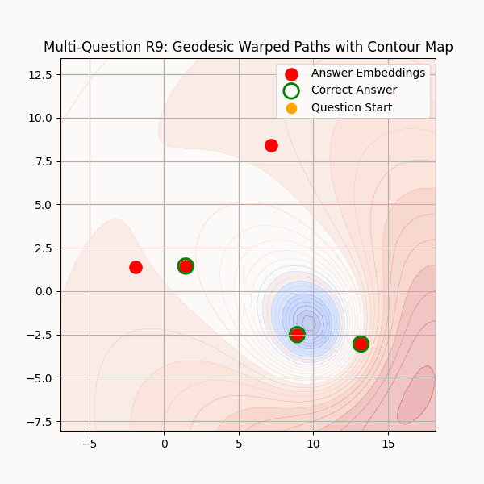
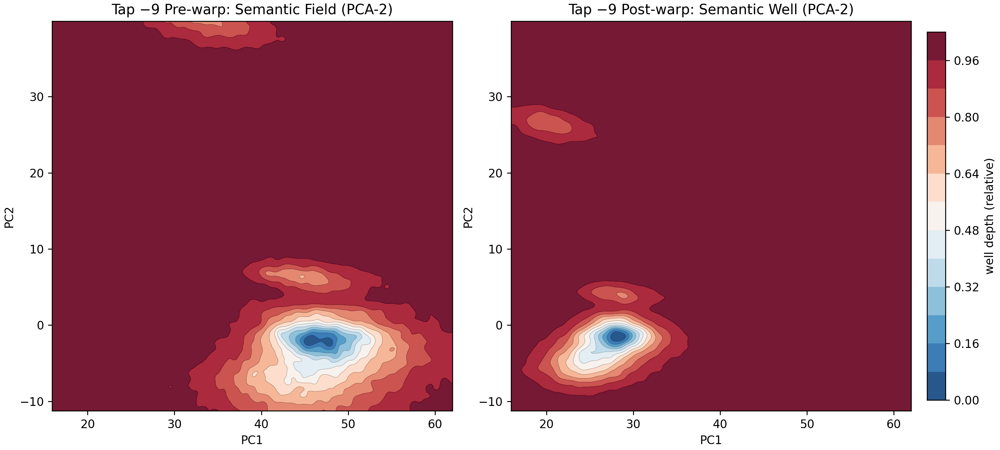

# Noetic Geodesic Framework (Alpha)
🚀 **The Noetic Geodesic Framework (NGF)** is a geometric approach to deterministic AI reasoning. It reframes reasoning in latent space as geodesic traversals through warped manifolds, where semantic structure is enforced by energy wells. This allows us to suppress hallucinations and enforce stable, truth-aligned reasoning.

NGF builds on two key pillars:
* Latent Vector Embeddings — high-dimensional representations (used across modern AI, including LLMs).
* Warp → Detect → Denoise Doctrine (Stage 11) — our pipeline that shapes these embeddings into deterministic geodesic trajectories.

### LLMs vs Vector Embeddings
* LLMs (Large Language Models): Sequence models that operate on tokens, typically built on transformer architectures. They internally rely on vector embeddings (hidden states) but expose only the text interface.
* Vector Embeddings: High-dimensional vectors that encode semantic meaning. These can be obtained independently of an LLM (e.g., sentence embeddings, ARC synthetic embeddings) and are directly manipulable.

**NGF operates at the embedding level**, not at the text level. This means NGF methods are pluggable into any LLM or embedding model. Instead of manipulating prompts or fine-tuning weights, NGF directly reshapes latent trajectories in vector space.

## Research Plan Stages
The NGF follows a 12-step research plan, with 10 completed stages posted here. Step 10 is the public rollout with NVIDIA A100 results. Steps 11-12 (milestone reports) are in progress.

| Stage | Description | Phase | Hardware | Folder/Code |
|-------|-------------|-------------|-------------|-------------|
| 1 | [Toy Example](toy-example/stage1.ipynb) | Toy Example $R^4$ | CPU | toy-example/ |
| 2 | [Embed Grid Intelligently](embed-grid/stage2.ipynb) | Toy Example $R^4$ | CPU | embed-grid/ |
| 3 | [Rotation Matrix Integration](rotation-matrix/stage3.ipynb) | Toy Example $R^4$ | CPU | rotation-matrix/ |
| 4 | [Simulate Pattern Completion](pattern-completion/stage4.ipynb) | Toy Example $R^4$ | CPU | pattern-completion/ |
| 5 | [Higher-Dim Embeddings](higher-dim-embeddings/stage5.ipynb) | Higher Dim $R^9$ | CPU | higher-dim-embeddings/ |
| 6 | [Integrate Dynamic Intelligence](dynamic-intelligence/stage6.ipynb) | Higher Dim $R^9$ | CPU | dynamic-intelligence/ |
| 7 | [ARC Question](rudimentary-arc/stage7.ipynb) | Higher Dim $R^9$ | CPU | rudimentary-arc/ |
| 8 | [LLM Latent Embedding](llm-latent-embedding/stage8.ipynb) | LLM System | CPU | llm-latent-embedding/ |
| 9 | [Warp LLM Interference](warp-interference/stage9.py) | LLM System | CPU | warp-interference/ |
| 10 | [Rudimentary Benchmarks](rudimentary-benchmarks/stage10-benchmark-latest.py) | LLM System  | CPU | rudimentary-interference/ |
| 11 | [Small Benchmarks](small-benchmarks/quickstart.md) | LLM System   | CPU | small-benchmarks/ |
| 12 | Large Benchmark (coming) | LLM System* | A100 | milestone-benchmark/ |

(*) **Note**: Integration of NGF with LLM pending

## Illustration: NGF Warped vs Flat Paths (Re: Stage 5)

This animation shows how warped paths converge to correct answers in high-dimensional semantic space:



## Requirements
- Python 3.x
- `transformers==4.55.2`
- `torch==2.8.0`
- `numpy==2.0.2`
- `scikit-learn==1.6.1`
- NVIDIA A100 GPU (e.g., Colab Pro+)

## Setup
Install dependencies:
```bash
!pip install transformers==4.55.2 torch==2.8.0 numpy==2.0.2 scikit-learn==1.6.1
```

Alternative (reproducible env via uv + Makefile):
```bash
make init   # creates .venv with uv and syncs deps
make nb     # launches Jupyter from the venv
```

## Stage-11 (Current): Warp → Detect → Denoise
Stage-11 introduced the breakthrough:
* **Warp:** Embed latents into PCA(3) space, warp into a single dominant well.
* **Detect:** Use matched filters with null calibration to identify the true well.
* **Denoise:** Apply smoothing, phantom guards, and jitter averaging to suppress false wells.

#### Latent-ARC Results (n=100)
| Model            | Exact Acc | Precision | Recall | F1     | Halluc. | Omission |
|------------------|-----------|-----------|--------|--------|---------|----------|
| Denoise (Stage 11)| **1.000** | 0.9977    | 0.9989 | 0.9983 | 0.0045  | 0.0023   |
| Geodesic (pre)   | 0.640     | 0.8450    | 1.0000 | 0.8980 | 0.1550  | 0.0000   |
| Stock baseline   | 0.490     | 0.8900    | 0.7767 | 0.7973 | 0.1100  | 0.2233   |

#### LMM-HellaSwag Results (n=1000)
| Model            | F1 | ECE (Caliibration) | Brier Score | Overconfidence >0.70  |
|------------------|-----------|-----------|--------|--------|
| MaxWarp (Stage 11)| **0.356** | 0.080   | 0.743 | 1.2% | 
| Stock baseline   | 0.324    | 0.122   | 0.750 | 0.7% | 
| Change ($\Delta$)   | +0.032 (good)   | -0.032 (good)   | -0.007 (good) | 0.5% | 

**Note**: Stock baseline approximates what you’d see if you used simple thresholds on LLM latents/logits without NGF’s Warp→Detect→Denoise.

#### How This Relates to LLMs
* NGF is not a new LLM. It is a geometry-on-latents module.
* You can integrate NGF with any embedding-producing model (LLMs, encoders, diffusion models).
* **Example**: an LLM provides hidden states → NGF warps them → trajectories follow deterministic geodesics instead of drifting probabilistically.
This separation is critical: LLMs handle language; NGF handles geometry.

#### Run latest benchmark on latents:
```bash
python -u small_benchmark/stage11_benchmark_latest.py \
      --samples 100 --seed 42 \
      --latent_arc --latent_dim 64 --latent_arc_noise 0.05 \
      --denoise_mode hybrid --ema_decay 0.85 --median_k 3 \
      --probe_k 5 --probe_eps 0.02 --conf_gate 0.65 --noise_floor 0.03 \
      --seed_jitter 2 --log INFO \
      --out_json latent_arc_denoise_100.json --out_csv latent_arc_denoise_100.csv
```

#### Run latest benchmark on LMM:

```bash
export NGF_RENO_CFG="use_denoise=1 denoise_mode=ema denoise_beta=0.22 denoise_ph_lambda=0.35 \
phantom_k=8 phantom_lambda=0.28 squeeze_orth_lambda=0.20 \
k_det=9 g_det_max=1.26 det_robust=mad winsor_q=0.985 \
alpha_min=0.034 alpha0=0.14 alpha_r_gamma=0.45 alpha_r_p=1.6 \
anneal_tokens=40 anneal_scale=1.85 outlier_q=1.0 outlier_alpha_scale=1.0 tap=-9"

python3 small_benchmark/ngf_benchmark.py --mode ngf --ngf_import ngf_hooks_v2:attach_ngf_hooks \
      --model gpt2 --tap -9 --n 1000 \
      --alpha0 0.06 --alpha_min 0.012 --trend_tau 0.30 --k_tr 12 \
      --use_detect 1 --detect_width 22 --detect_sigma 4.5 --k_det 8 \
      --s_latch 0.35 --linger 3 --ema_center_beta=0.04 \
      --gen_mode geo --save_hidden 1 --hidden_dump_dir small_benchmark/results/maxwarpC_tap9_noOutlier \
      --out_json small_benchmark/results/maxwarpC_tap9_noOutlier/metrics.json
```

## Stage-11 (Summary / What’s Next)
* Tests on simulated latent environment provided a perfect F1 score for latent-ARC tests on GPT2
* Saw +3 incremental boost on F1 Score on HellaSwag for real LLM tests on GPT2
* For real LLM we can see noticable difference in semantic well PCA plots post warp when comparing before vs after (see Fig below)
* **Stage 11 nearly complete:** need to perform robustness checks on testing
* **Warp → Detect → Denoise doctrine is holding**, thus marking the first lightweight, geometry-driven path to upgrade LLMs by reshaping their latent manifolds for stability and truth alignment




## Technical Paper - WORK IN PROGRESS
- Moore, I. C. (2025). *Noetic Geodesic Framework: Deterministic AI Reasoning via Warped Manifolds (Early Preprint)*. Zenodo. https://zenodo.org/records/17032117 (DOI: 10.5281/zenodo.17032116), Sept 2025.
- **Disclaimer**: This is a preliminary alpha-stage document (Sept 1, 2025) avaliable [here](docs/article_latest.pdf) from repos , subject to change. Feedback is welcome! 
- Moore, I. C. (2025). *[Noetic Geodesic Framework: Deterministic AI Reasoning via Warped Manifolds (Early Preprint)](docs/article_latest.pdf)*. Zenodo. https://zenodo.org/records/17032117 (DOI: 10.5281/zenodo.17032116), Sept 2025.
- **Disclaimer**: This is a preliminary alpha-stage document (Sept 1, 2025), subject to change. Feedback is welcome! 
- Provisional patents filed as #63/864,726, #63/865,437, #63/871,647, and #63/872,334.

## References
- Moore, I. C. (2025). *Warped Semantic Manifolds: A Geometric Framework for Deterministic AI Reasoning (Preliminary Memo)*. Zenodo. https://zenodo.org/records/16908227 (DOI: 10.5281/zenodo.16730759), Aug 2025; see [code](toy-example/step1.ipynb)

## Medium Articles
 * **Toy Example in $R^3$**: [Warped Semantic Manifolds: A Geometric Approach to AI Reasoning](https://medium.com/@icmoore/warped-semantic-manifolds-a-new-path-to-flawless-ai-reasoning-d2328c91d920)
 * **Higher Dimensional Embeddings in $R^9$**: [How Semantic Mass Shapes AI Reasoning in R^9](https://medium.com/@icmoore/how-semantic-mass-warps-ai-thoughts-to-flawless-convergence-879e2f6f3373)
 * **Warping LLM Interference**: [Warping LLM Interference with Geodesic Nudges for Deterministic AI Reasoning](https://medium.com/@icmoore/warping-llm-interference-with-geodesic-nudges-for-deterministic-ai-reasoning-38663bbc1609)


## Onboarding
As these techniques are uncommon in AI, onboarding requires some prerequisites background knowledge in general relativity and differential geometry, coupled with a good understanding of the objectives behind each of the steps in the [12-staged research plan](#research-plan-stages). If this interests you, please see the **[onboarding docs](docs/onboarding.md)** for further detail.

## Contribute
This is alpha software! Help us refine prompts, test on other hardware, or improve the nudge. **Contributors must sign the [CLA](CLA.md) and email it to ngeodesic@gmail.com before submitting pull requests.**

If you find this helpful, please leave a ⭐!
